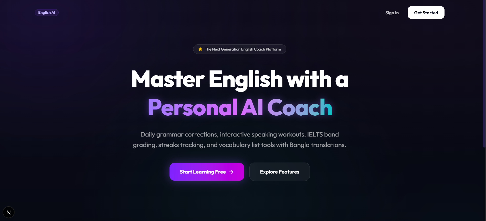
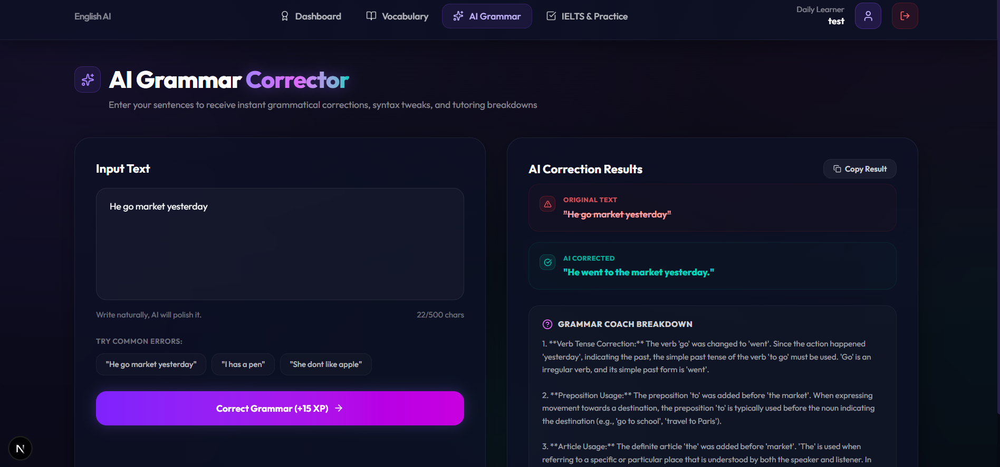
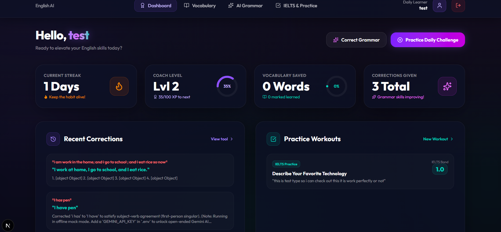
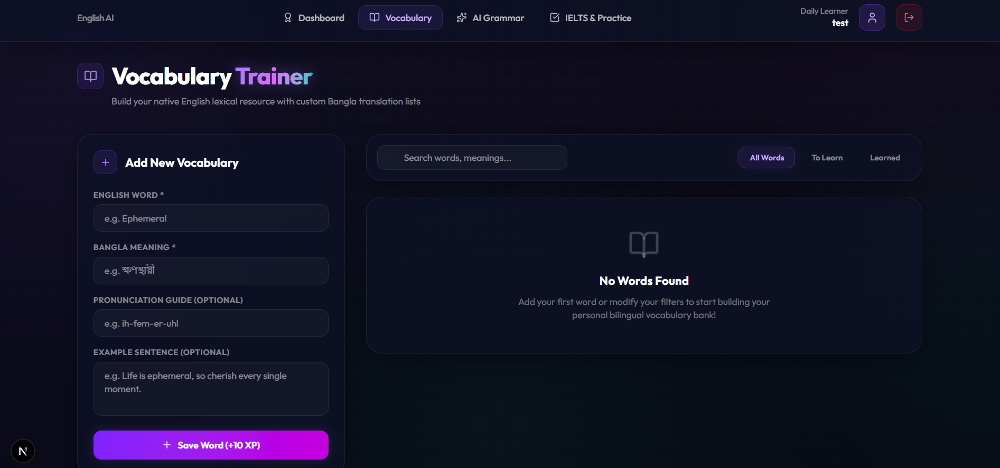
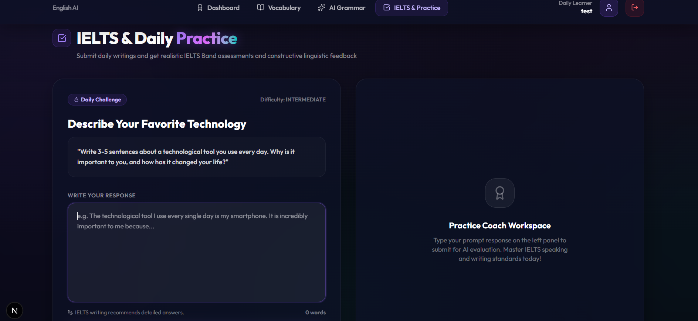

# 🌌 Antigravity English AI — Fullstack Learning Platform

A premium, SaaS-style AI-powered English learning platform designed to help users establish daily speaking habits, practice bilingual vocabulary, receive granular grammatical syntax corrections, and assess their skills against official IELTS grading frameworks. 

Built with a stunning **glassmorphic space-dark design system** and real-time database-driven progress analytics.

---

## 📸 Platform Showcase (Screenshots)

### 🌌 1. The High-Converting Landing Page
*A sleek dark-mode entrance utilizing orbital gradients, active hover scaling, and clean CTA actions.*

---

### 📊 2. Interactive Habits Dashboard
*Shows active daily streaks, coach level progression, circular SVG stats rings, and timeline logs.*

---

### 📝 3. Side-by-Side AI Grammar Corrector
*Enter incorrect sentences to view dynamic red-strikethrough vs. green-corrected comparisons and detailed coach accordion tutoring.*

---

### 📚 4. Vocabulary Trainer with Bangla Meanings
*Save native terms with phonetic pronunciation scripts, custom Bangla translations, search engines, and optimistic checkmarks.*

---

### 🏆 5. Daily IELTS Practice Coach
*Submit paragraph cue card responses for daily challenges and get graded on an official IELTS scale (1.0 to 9.0) with detailed marker reviews.*

---

## ⚡ Core Features

| Feature | Description | Tech Stack / Engine | XP Rewards |
| :--- | :--- | :--- | :---: |
| **🔐 Advanced Auth** | Secure login/registration, protected dashboard routes, and instant test account bypasses. | Auth.js (v5) & Middleware | — |
| **📊 Smart Stats** | Streak increments, interactive circular SVGs, and live activity timelines. | Prisma & SQLite | — |
| **📝 Grammar Diff** | Visual syntax highlight diffs comparing incorrect vs. corrected sentences with tutor rules. | Google Gemini 2.5 API | `+15 XP` |
| **📚 Bangla Vocab** | Double-sided English-Bangla vocabulary database with interactive mastery toggles. | Optimistic Server Actions | `+10 XP` / `+5 XP` |
| **🏆 IELTS Grader** | Real-time examiner evaluation (1.0 to 9.0 score) reviewing coherence, grammar, and range. | Google Gemini 2.5 API | `+50 XP` |

---

